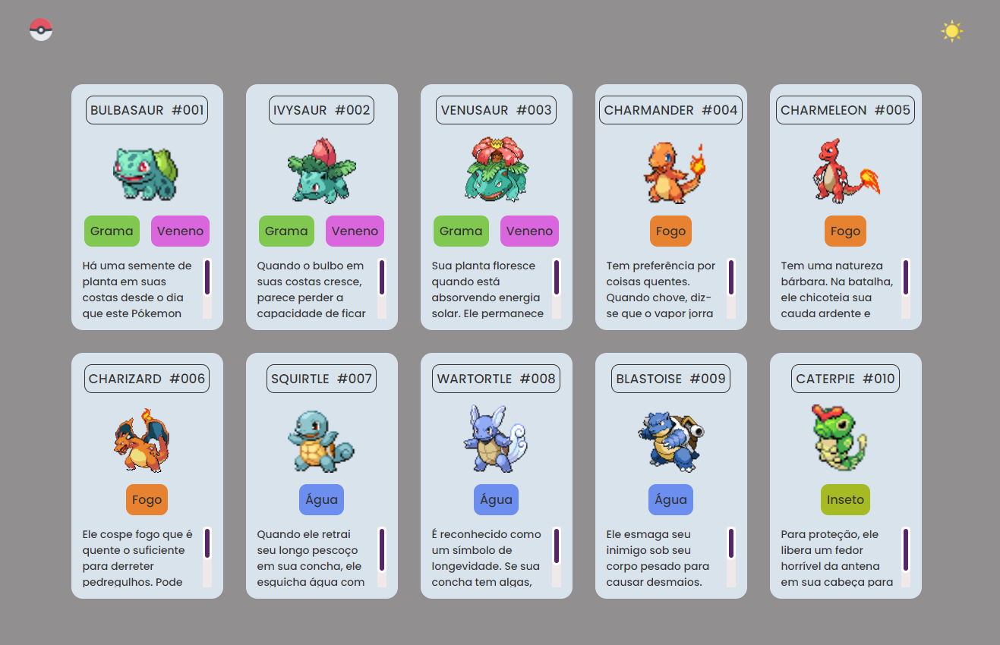
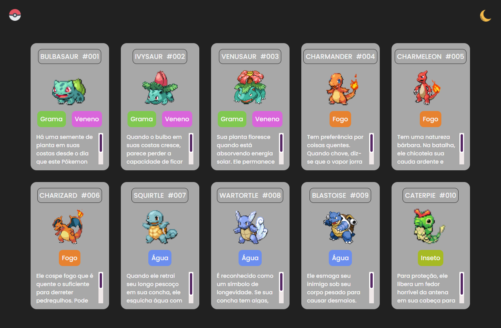

# Pokédex
## (Finalizado) - 21/05/2023
### Este projeto é baseado no evento da semana de programação desenvolvida pelo Dev Em Dobro

  <a href="#-tecnologias">Tecnologias</a>&nbsp;&nbsp;&nbsp;|&nbsp;&nbsp;&nbsp;
  <a href="#-projeto">Projeto</a>&nbsp;&nbsp;&nbsp;|&nbsp;&nbsp;&nbsp;
  <a href="#-layout">Layout</a>

## 🚀 Tecnologias

Esse projeto foi desenvolvido com as seguintes tecnologias:

- HTML, CSS e JS

## 💻 Projeto

O Site é uma lista curta com alguns pokémons, o intuito do evento é aproximar pessoas para a área de programação. Aproveitei para relembrar o básico de HTML/CSS/JS. Acredito que seria interessante retornar e adicionar por API mais pokémons.

## 🔖 Layout

    
Layout:

    

    
Layout Modo Escuro:

    

